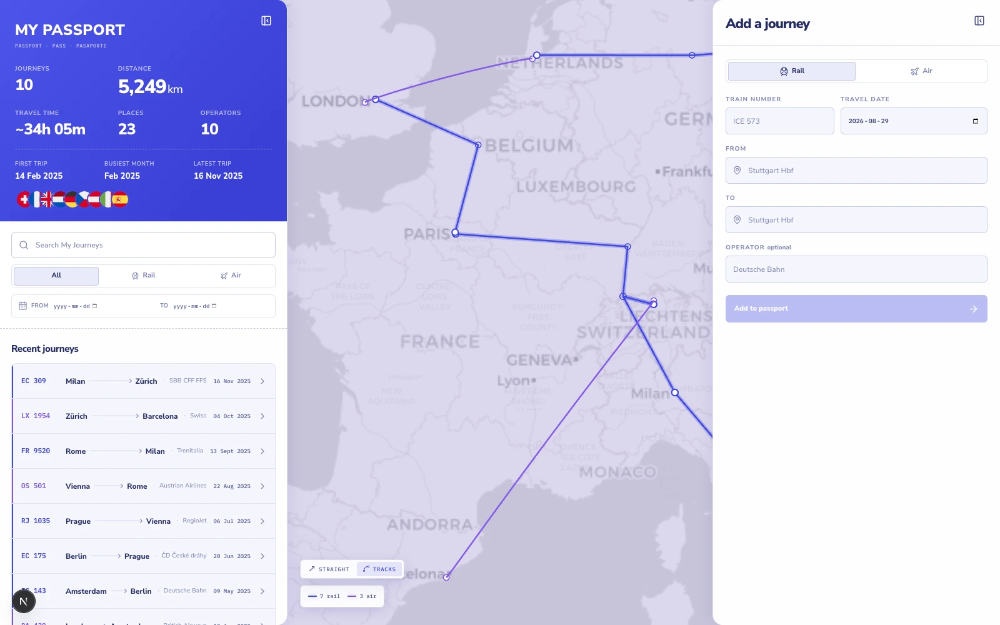
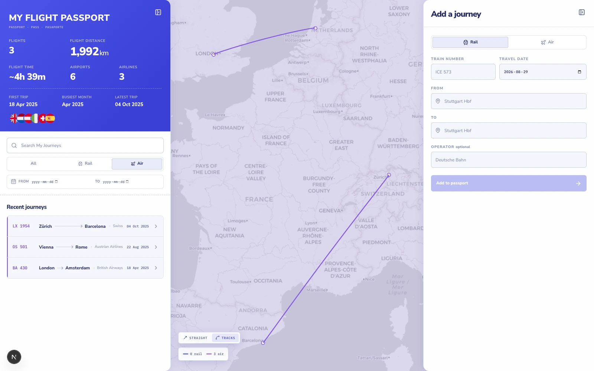
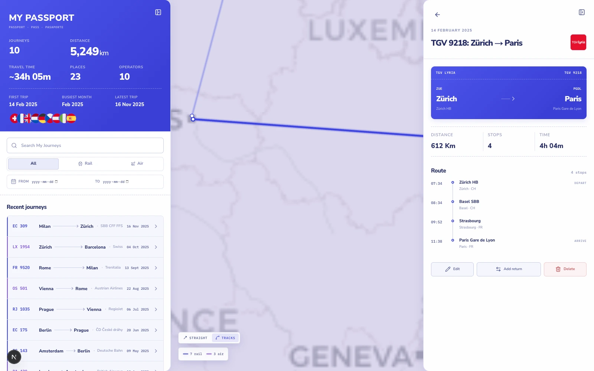
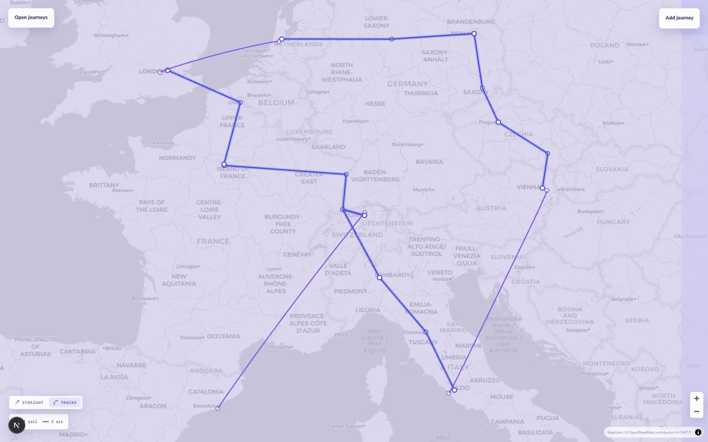
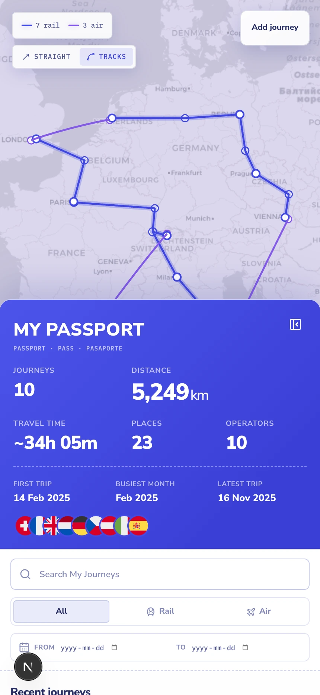
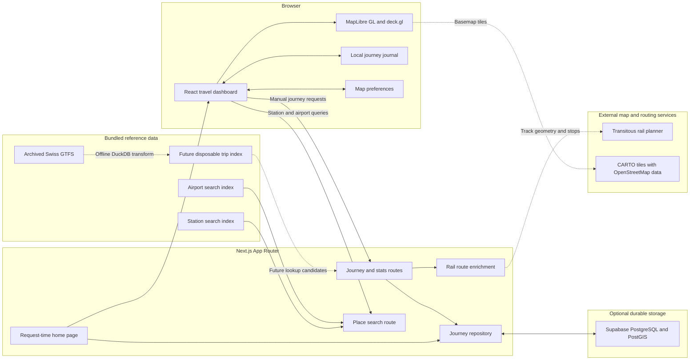

<div align="center">

# Rail Log

### A private, map-first passport for every train and flight you take.

Record journeys, trace rail routes and flight arcs across the map, and watch a
personal travel passport grow over time.

**Next.js 16 · React 19 · MapLibre GL · deck.gl · TypeScript · optional Supabase/PostGIS**

</div>



> [!NOTE]
> Rail Log starts empty. Every screenshot in this README was captured from the
> current UI with temporary documentation data; the application ships with no
> seeded or hardcoded journeys.

## What Rail Log does

- Keeps rail and air journeys together in one private travel journal.
- Draws routed rail paths with MapLibre GL and great-circle flight arcs with
  deck.gl.
- Builds all, rail-only, and flight-only passports with distance, travel time,
  places, operators, countries, and date highlights.
- Searches 52,241 European stations and 4,154 scheduled airports without sending
  the full catalogs to the browser.
- Adds, edits, deletes, and reverses journeys from a keyboard-friendly form.
- Enriches manual rail journeys with track geometry, calling points, and current
  scheduled times when Transitous can resolve the route.
- Filters the journal and map together by mode, date range, or text search.
- Switches rail visualization between routed tracks and straight endpoint lines.
- Stores data in the browser by default, with optional Supabase/PostGIS
  persistence for a protected private deployment.
- Fits the same workspace to desktop, tablet, and mobile screens.

## A tour of the interface

### One passport, two ways to travel

The main passport combines every trip. Switching to **Air** or **Rail** updates
the totals, countries, journey list, and visible map layers as one coordinated
view.



### Journey details down to the calling point

Select a line on the map or a row in the journal to inspect the route, operator,
distance, duration, and stops. From the same panel, a journey can be edited,
deleted, or used to create a return leg.



### Fast manual entry for rail and air

The form remembers useful context from the latest journey, searches known places,
suggests operators, and keeps origin, destination, mode, and date explicit.


### The map can take the whole canvas

Both side panels collapse independently when the route network is the focus.
Rail and air remain visually distinct, and the rail path control stays available.



### The same workspace on mobile

On narrow screens, the map stays visible while the passport becomes a bottom
sheet—no separate mobile experience or reduced feature set.

<p align="center">
  
</p>

## System architecture

The application separates personal journey data from regenerable reference data.
The browser is the safe default source of truth; enabling Supabase swaps in a
durable server repository without changing the UI contract.



The archived GTFS feed is deliberately outside the web request path. It is a
future input to an offline timetable transform, not something Next.js downloads
or processes while serving a user.

## Technology

| Layer | Used for |
| --- | --- |
| Next.js 16 App Router | Request-time page rendering and route handlers |
| React 19 + TypeScript | Interactive passport, filters, forms, and details |
| MapLibre GL JS | Basemap, rail paths, markers, popups, and viewport fitting |
| deck.gl | Flight arcs and interactive WebGL overlays |
| Tailwind CSS 4 + custom CSS | Build pipeline, layout, responsive sheets, and visual system |
| Transitous | Best-effort rail geometry, calling points, and current route times |
| Trainline EU station data | Generated European station search index |
| OurAirports | Generated scheduled-airport search index |
| Supabase + PostGIS | Optional private, durable journey persistence |
| Node test runner + ESLint | Unit tests and static checks |

## Run it locally

### Requirements

- Node.js 20.9 or newer
- npm
- A modern browser with WebGL enabled

### Start the app

```bash
git clone <your-fork-or-repository-url>
cd trainy
npm install
npm run dev
```

Open [http://localhost:3000](http://localhost:3000). With no environment
variables, the journal is saved in that browser under
`rail-log:journeys:v1`.

To exercise a production build locally:

```bash
npm run build
npm start
```

## Persistence modes

### Browser-local mode — default

No configuration is required. Each browser gets its own empty journal, and no
personal journey data is sent to a database. This is the recommended mode for a
public portfolio deployment.

### Supabase mode — private deployments only

Copy the environment template and provide server-only credentials:

```bash
cp .env.example .env.local
```

```dotenv
SUPABASE_URL=
SUPABASE_SERVICE_ROLE_KEY=
DATABASE_URL=
NEXT_PUBLIC_CARTO_API_KEY=
```

Create the schema and import the place table from the repository root:

```bash
psql "$DATABASE_URL" -v ON_ERROR_STOP=1 -f db/migrations/001_initial.sql
psql "$DATABASE_URL" -v ON_ERROR_STOP=1 -f db/import-places.sql
```

> [!WARNING]
> The server routes use the Supabase service role and do not implement end-user
> authentication. Protect the entire deployment before configuring Supabase.
> Never expose the service-role key through a `NEXT_PUBLIC_` variable.

On the first database-backed load, a browser journal is migrated only if the
remote journal is empty. The local copy remains available as a fallback. See
[the deployment guide](docs/deployment.md) for the complete rollout checklist.

## Reference data

The search catalogs are generated artifacts, not runtime downloads:

```bash
npm run sync:stations
npm run sync:airports
# or refresh both
npm run sync:places
```

- `data/stations.json` contains the ranked station index derived from the
  Trainline EU dataset.
- `data/airports.json` contains the scheduled-airport index derived from
  OurAirports.
- `data/places.csv` is the database import form used by PostGIS.
- `data/gtfs/archive/` documents the validated Swiss 2026 GTFS snapshot. The
  large ZIP is ignored by Git; its checksum and restoration details are
  versioned in [the archive manifest](data/gtfs/archive/README.md).

Manual rail entry calls Transitous on the server. If routing is unavailable,
slow, or returns the wrong endpoints, Rail Log falls back safely to the two
confirmed endpoint coordinates instead of inventing track geometry.

## HTTP API

| Method | Endpoint | Purpose |
| --- | --- | --- |
| `GET` | `/api/places/search?kind=station&q=Berlin+Hbf` | Search stations |
| `GET` | `/api/places/search?kind=airport&q=FRA` | Search airports |
| `POST` | `/api/legs/manual` | Create a manual journey |
| `PUT` | `/api/legs/manual` | Update a manual journey |
| `GET` | `/api/legs?mode=rail` | Read the journal, optionally by mode |
| `DELETE` | `/api/legs?id=<journey-id>` | Delete a persisted journey |
| `POST` | `/api/legs/migrate` | Migrate a validated browser journal |
| `GET` | `/api/map` | Return journey lines as GeoJSON |
| `GET` | `/api/stats` | Return calculated passport statistics |
| `GET` | `/api/lookup?number=ICE+573&date=2026-07-14` | Reserved timetable lookup seam |

Timetable-number lookup is intentionally not connected yet: the route validates
the request and returns an empty candidate list until the offline GTFS index is
built.

## Project layout

```text
src/
├── app/
│   ├── api/                 # Route handlers
│   ├── globals.css          # Complete responsive visual system
│   ├── layout.tsx           # Fonts, metadata, and global setup
│   └── page.tsx             # Request-time application entry
├── components/
│   ├── journey-map.tsx      # MapLibre and deck.gl renderer
│   ├── map-shell.tsx        # Client-only map boundary
│   └── travel-dashboard.tsx # Passport, filters, forms, and details
└── lib/                     # Domain, repositories, routing, search, and stats

data/                        # Generated place indexes and GTFS archive metadata
db/                          # PostgreSQL/PostGIS migration and import scripts
docs/                        # Architecture, deployment, design, and screenshots
scripts/                     # Data and MapLibre worker synchronization
tests/                       # Node unit tests
```

## Quality checks

```bash
npm test
npm run lint
npx tsc --noEmit
npm run build
```

The test suite covers place ranking, journey statistics, distances, routed rail
geometry, journal validation, airlines, and rail operators.

## Current roadmap

- Transform the archived Swiss GTFS snapshot into a disposable rail-only trip
  index with DuckDB.
- Connect train-number and date lookup to real candidates and historical
  `shapes.txt` geometry.
- Add end-user authentication before supporting shared or multi-user Supabase
  deployments.
- Expose the existing versioned journal backup primitives through the UI.

More implementation detail lives in [docs/implementation.md](docs/implementation.md),
with longer-term work tracked in [docs/next-steps.md](docs/next-steps.md).
