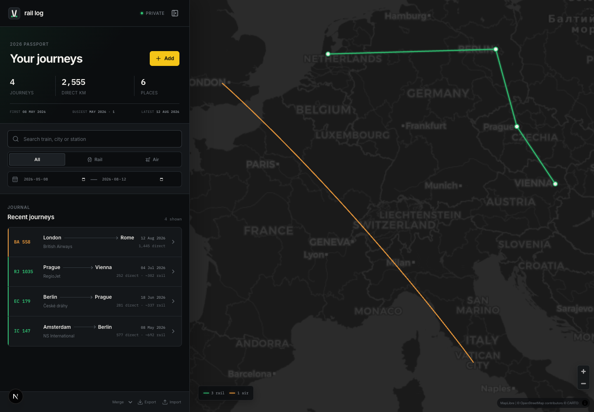

# Rail Log



A private, map-first passport for train and flight journeys. Rail Log starts
empty, lets you record your own journeys, and draws them in WebGL without
shipping hardcoded trips in the application.

## What works

- MapLibre GL + deck.gl map with rail paths, flight arcs, visited-place markers,
  selection, responsive fitting, and rail/air filtering
- Search across 52,241 European station records and 4,154 scheduled airports;
  real/main stations and large IATA airports are ranked above noisier records
- Manual add, edit, delete, and one-click return journeys
- Sticky travel date/origin, recent-place suggestions, and keyboard combobox
  navigation
- Date-range filtering plus first trip, latest trip, and busiest-month stats
- Direct geodesic distance with a clearly labelled display-only rail estimate
- Versioned JSON export/import with explicit merge and replace modes
- Browser-local journals by default, with optional Supabase/PostGIS persistence
  and first-load localStorage migration

The screenshot uses temporary browser data for documentation only. A fresh app
contains no demo or seeded journeys.

## Architecture

The central boundary follows
[`docs/rail-log-architecture (1).md`](docs/rail-log-architecture%20(1).md):
regenerable reference/timetable data ends at the trip index, while confirmed
personal journeys are copied into a durable log.

```text
Trainline + OurAirports -> generated search indexes -> place search API

archived GTFS -> future DuckDB transform -> disposable trip index
                                                |
manual entry / future lookup -------------------+-> personal journal -> WebGL map
```

The Next.js request path never downloads or transforms source datasets. Batch
inputs and serving data remain separate.

## Run locally

```sh
npm install
npm run dev
```

Open [http://localhost:3000](http://localhost:3000). Without environment
variables, journeys are stored under `rail-log:journeys:v1` in that browser.
Refresh the generated station and airport catalogs with:

```sh
npm run sync:places
```

## Optional Supabase persistence

Create a Supabase project, copy `.env.example` to `.env.local`, and set the
server-only `SUPABASE_URL` and `SUPABASE_SERVICE_ROLE_KEY` variables. Never put
the service-role key in a `NEXT_PUBLIC_` variable.

Use the direct or session-pooler Postgres connection string as `DATABASE_URL`,
then run from the repository root:

```sh
psql "$DATABASE_URL" -v ON_ERROR_STOP=1 -f db/migrations/001_initial.sql
psql "$DATABASE_URL" -v ON_ERROR_STOP=1 -f db/import-places.sql
```

The import builds PostGIS points with longitude first. On first database-backed
load, a browser journal is uploaded only when the remote journal is empty, and
the browser copy remains as a backup. RLS blocks direct anonymous table access;
the app accesses the database only from server routes.

Important: those server routes use the service role and do not yet implement
end-user authentication. Do not expose a Supabase-configured deployment to the
public internet without deployment-level access protection. A public portfolio
deployment should omit the Supabase variables, giving each visitor an isolated
browser-local journal. See [`docs/deployment.md`](docs/deployment.md).

## Timetable archive

The official nationwide Swiss GTFS snapshot for 2026 has been downloaded and
validated locally. Its source, coverage, restore command, and SHA-256 live in
[`data/gtfs/archive/README.md`](data/gtfs/archive/README.md). The 224 MB ZIP is
ignored by Git, while its manifest is versioned.

Train-number lookup remains the documented phase-two seam: the archive still
needs an offline DuckDB rail-only transform before `/api/lookup` can return
candidates or real `shapes.txt` geometry.

## API

- `GET /api/places/search?kind=station&q=Berlin+Hbf`
- `GET /api/places/search?kind=airport&q=FRA`
- `POST|PUT /api/legs/manual`
- `GET|DELETE /api/legs`
- `POST /api/legs/migrate`
- `GET /api/map`
- `GET /api/stats`
- `GET /api/lookup?number=ICE+573&date=2026-07-14` (returns no matches until the
  timetable index is built)

## Design decisions

- Manual entry shipped before lookup so the personal journal is useful without
  pretending incomplete timetable coverage is reliable.
- Endpoint geometry is stored honestly. Rail distance keeps the direct PostGIS
  value and applies the temporary 1.2× estimate only in presentation.
- No hardcoded journeys or automatic demo mode: personal data starts empty and
  the README screenshot carries the visual story.
- The page explicitly renders at request time so a Supabase journal cannot be
  embedded in a static Next.js build artifact.

## Checks

```sh
npm test
npm run lint
npx tsc --noEmit
npm run build
```
